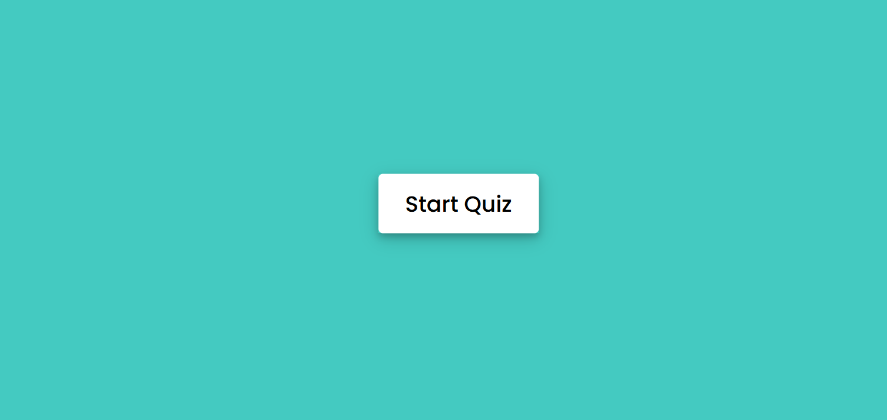
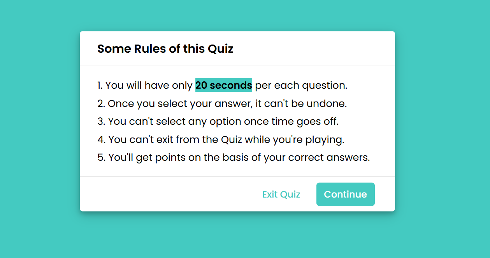
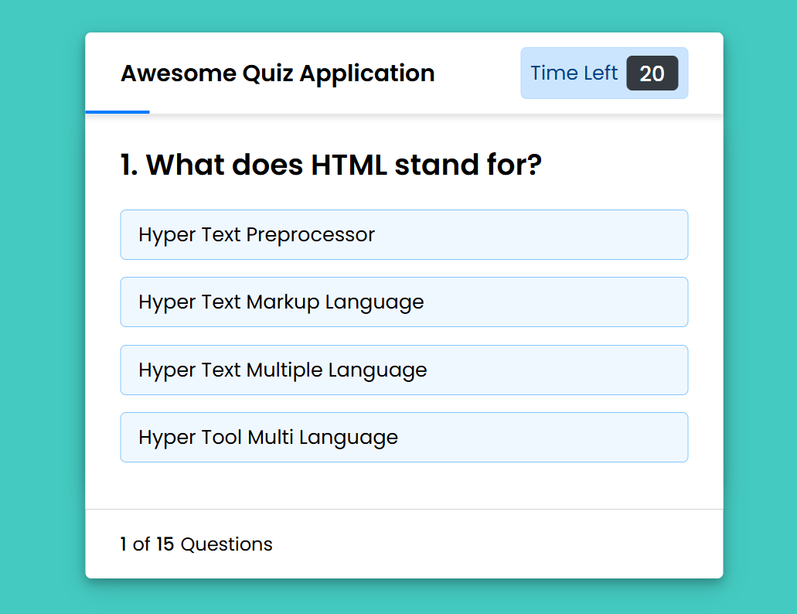

# Interactive Quiz Application

Welcome to the **Interactive Quiz Application**, a sleek and dynamic web-based quiz platform built using **HTML**, **CSS**, and **JavaScript**. Whether you're preparing for exams or just brushing up on your skills, this app makes learning **fun, fast, and interactive**!

---

## 🌐 Live Website: [Quiz Application](https://interactive-quiz-application-chi.vercel.app/)

## 🎬 Sample Video: [Video](https://drive.google.com/file/d/1cIiCMZzYux8HUHzfiNzVZ0Sjqnp1ddGT/view?usp=sharing)

---

## 🚀 Features

✅ Real-time score tracking  
✅ Timer for each question
✅ Intuitive and responsive UI  
✅ Instant feedback on answers  
✅ Smooth transitions and animations

---

## 🧠 Quiz Subjects

You can test your knowledge in:

- 🖥️ Programming  
- 🧮 Mathematics  
- 🧠 Aptitude  
- 🏛️ History  

---

## 📸 Interface Preview

| Home Page | Quiz Rules | Questions |
|----------------|--------------|-------------|
|  |  |  |

---

## 🛠️ Tech Stack

- **HTML** – Structure the content  
- **CSS** – Style the interface  
- **JavaScript** – Drive the logic and interactivity

---

## 💻 How to Run Locally

1. Clone the repository  
```bash
git clone https://github.com/neelanshu7/Interactive_Quiz_Application.git
```
2. Navigate to the folder
```bash
cd Interactive_Quiz_Application
```
3. Open index.html in your browser
```bash
start index.html
```
## 🧩 Folder Structure
```bash
📁 Interactive_Quiz_Application/
├── index.html           # Landing page
├── style.css            # Styling and layout
├── questions.js         # Question
├── script.js            # Core JS functionalities
├── screenshots/         # Interface Screenshots
```
